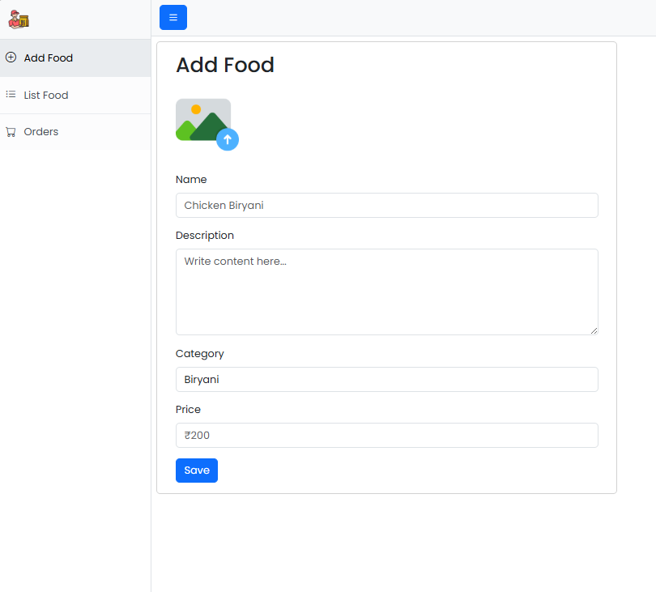
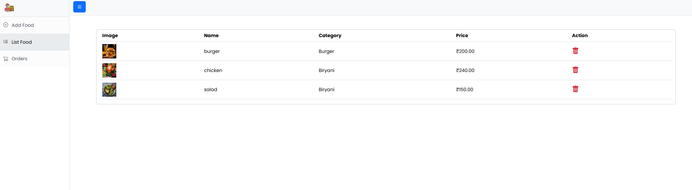
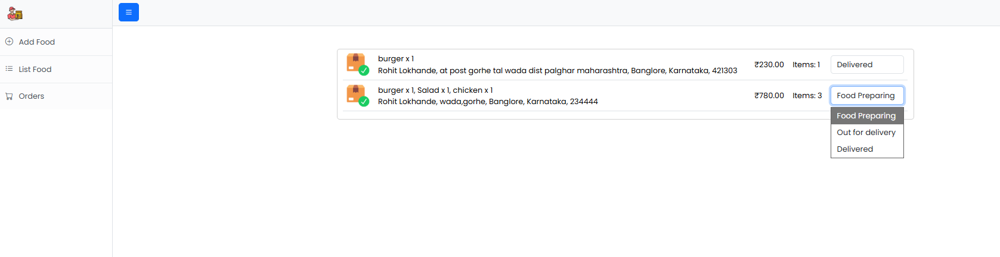

# 👨‍💼 FoodLand Admin Panel - Restaurant Management System

<div align="center">


**Powerful admin dashboard to manage food items, orders, and deliveries**

[](https://github.com/Rohit6168/onlinefoodadmin)
[](https://reactjs.org/)
[](https://spring.io/)

</div>

---

## 📋 Table of Contents

- [Overview](#-overview)
- [Features](#-features)
- [Tech Stack](#-tech-stack)
- [Screenshots](#-screenshots)
- [Getting Started](#-getting-started)
- [Project Structure](#-project-structure)
- [API Integration](#-api-integration)
- [Order Status Management](#-order-status-management)
- [Related Repositories](#-related-repositories)
- [Contributing](#-contributing)
- [Contact](#-contact)

---

## 🌟 Overview

FoodLand Admin Panel is a comprehensive restaurant management dashboard that empowers administrators to efficiently manage their food menu, track customer orders, and update delivery statuses in real-time. The panel seamlessly integrates with the user-facing application to provide a complete food ordering ecosystem.

### 🎯 Key Highlights

- 🍕 **Food Management** - Add, view, and delete food items
- 📦 **Order Tracking** - Monitor all customer orders in real-time
- 🔄 **Status Updates** - Change order status through intuitive dropdown
- 📊 **Dashboard Analytics** - Quick overview of menu and orders
- 🖼️ **Image Upload** - Add food images with descriptions
- 💰 **Price Management** - Set and update food prices
- 🏷️ **Category Organization** - Organize foods by categories

---

## ✨ Features

### 🍔 Food Management

#### ➕ Add Food
- 📤 **Image Upload** - Upload food images
- 📝 **Name** - Enter food item name (e.g., "Chicken Biryani")
- 📄 **Description** - Add detailed description
- 🏷️ **Category** - Select category (Biryani, Burger, Salad, etc.)
- 💰 **Price** - Set price in rupees (e.g., ₹200)
- 💾 **Save** - Submit to add item to menu

#### 📋 List Food
- 📊 **Table View** with columns:
  - 🖼️ **Image** - Food item thumbnail
  - 📛 **Name** - Food item name
  - 🏷️ **Category** - Food category
  - 💵 **Price** - Item price
  - ⚡ **Action** - Delete button
- 🗑️ **Delete Food** - Remove items from menu
- 🔍 **Quick Search** - Find items quickly

### 📦 Order Management

#### 📋 Orders Dashboard
- 🎯 **Order List** showing:
  - 🛒 **Order Items** - List of all items in order
  - 📍 **Customer Details**
    - Name
    - Full delivery address
    - City, State, ZIP code
  - 💰 **Total Amount** - Order value
  - 👥 **Items Count** - Number of items
  - 📊 **Current Status** - Visual status indicator

#### 🔄 Status Management
Real-time status updates with dropdown:
- 🟡 **Preparing** - Initial order status
- 🔵 **Food Preparing** - Kitchen is preparing the food
- 🚚 **Out for Delivery** - Order dispatched for delivery
- ✅ **Delivered** - Order successfully delivered

**Status Updates:**
- Admin selects new status from dropdown
- Status instantly reflects on user's order page
- Customer can track order progress in real-time

### 🎨 User Interface
- 🔵 **Clean Blue Theme** - Professional sidebar design
- 📱 **Responsive Layout** - Works on all screen sizes
- 🧭 **Easy Navigation**
  - Add Food
  - List Food
  - Orders
- 🎨 **Modern Design** - Clean and intuitive interface
- ⚡ **Fast Loading** - Optimized performance

---

## 🛠 Tech Stack

### Frontend


- ⚛️ **React 18** - UI library for admin dashboard
- ⚡ **Vite** - Fast build tool with HMR
- 🎨 **CSS3** - Custom styling for admin interface
- 🧭 **React Router** - Navigation between admin pages
- 🌐 **Axios** - API communication
- 📤 **File Upload** - Image upload handling

### Backend Integration


- 🍃 **Spring Boot** - REST API backend
- 🔐 **Spring Security** - Admin authentication
- 🗄️ **MySQL** - Database for food items and orders
- 💾 **JPA/Hibernate** - ORM for database operations

### Image Storage


- ☁️ **Cloudinary** - Cloud-based image storage (optional)
- 📤 **Multipart Upload** - Direct file upload to server

---

## 📸 Screenshots

### 🍔 Food Management
<table>
  <tr>
    <td><br/><b>Add Food Form</b></td>
    <td><br/><b>Food Items List</b></td>
  </tr>
</table>

### 📦 Order Management
<table>
  <tr>
    <td colspan="2"><br/><b>Orders Dashboard with Status Dropdown</b></td>
  </tr>
</table>

---

## 🚀 Getting Started

### Prerequisites

- 💻 **Node.js** (v18 or higher)
- ☕ **Java JDK** (v17 or higher)
- 🗄️ **MySQL** (v8 or higher)
- 📦 **npm** or **yarn**
- 🔧 **Git**

### Installation & Setup

1. **📥 Clone the repository**
   ```bash
   git clone https://github.com/Rohit6168/onlinefoodadmin.git
   cd onlinefoodadmin
   ```

2. **📦 Install dependencies**
   ```bash
   npm install
   # or
   yarn install
   ```

3. **⚙️ Configure environment variables**
   
   Create a `.env` file in the root directory:
   ```env
   VITE_API_BASE_URL=http://localhost:8080/api
   VITE_ADMIN_SECRET=your_admin_secret_key
   ```

4. **🚀 Start development server**
   ```bash
   npm run dev
   # or
   yarn dev
   ```
   
   The admin panel will run on `http://localhost:5173`

5. **🏗️ Build for production**
   ```bash
   npm run build
   # or
   yarn build
   ```

### Backend Setup

Ensure the backend API is running. Refer to the backend repository for setup instructions.

---

## 📁 Project Structure

```
onlinefoodadmin/
├── public/
│   └── assets/
│       └── admin-logo.png
├── src/
│   ├── components/
│   │   ├── Sidebar/
│   │   │   └── Sidebar.jsx
│   │   ├── Navbar/
│   │   │   └── AdminNavbar.jsx
│   │   ├── AddFood/
│   │   │   ├── AddFoodForm.jsx
│   │   │   └── ImageUpload.jsx
│   │   ├── ListFood/
│   │   │   ├── FoodTable.jsx
│   │   │   └── FoodRow.jsx
